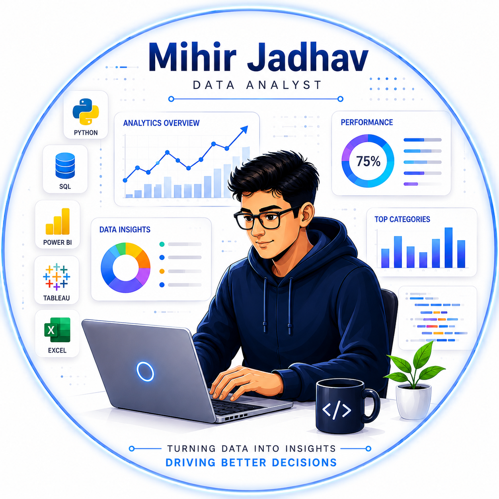

<h1 align="center">
  
</h1>

<h2 align="left">📫 Contact Me</h2>

---

## 🚀 About Me

  

I am a passionate **Data Analyst** * with practical knowledge of **SQL, Python, Power BI, Tableau, Excel, and Business Analytics**.

I enjoy transforming raw data into meaningful insights, interactive dashboards, and business-focused recommendations that support data-driven decision-making.

### 🎯 What I Do

- 📊 Build interactive dashboards using **Power BI** and **Tableau**
- 🐍 Analyze and automate workflows using **Python**
- 🗄️ Design optimized databases and write advanced **SQL** queries
- 📈 Perform business analysis using **RCA, SWOT, BRD, FRD, and UAT**
- 📋 Create reports that support business decision-making

---

<h1 align="Left side">⚡ Tech Stack & Tools</h1>

### 💻 Programming Languages

---

### 📊 Data Analysis

---

### 📈 Dashboarding & Data Visualization

---

### 🗄️ Database Management

---

### 🤖 Machine Learning

---

### 📑 Excel Skills

---

### 📋 Business Analysis

---

### 🛠️ Tools

---

---

<h1>⭐ Featured Projects</h1>

<table>
<tr>
<td width="33%" valign="top">

<h3>✈️ Aerox Aviation Database & Analytics System</h3>

Designed a normalized SQL database for airline operations including passengers, bookings, routes, crew, airport services, transactions, revenue, and customer feedback analysis.

<b>Tools:</b> SQL • MySQL • Database Design • ERD

</td>

<td width="33%" valign="top">

<h3>📈 Fundraising Analytics Dashboard</h3>

Built an interactive dashboard to analyze campaign success rate, donor behavior, marketing performance, fundraising methods, and ROI improvement opportunities.

<b>Tools:</b> Excel • Power Query • Looker Studio

</td>

<td width="33%" valign="top">

<h3>🎓 Learning & Development Analytics Dashboard</h3>

Created a Power BI dashboard to analyze training performance, employee engagement, department-wise ROI, completion status, and performance gain.

<b>Tools:</b> Power BI • Excel • DAX • KPI Analysis

</td>
</tr>
</table>

---

  ❤️ Thank you for visiting my profile! Let’s connect and create data-driven impact together.

